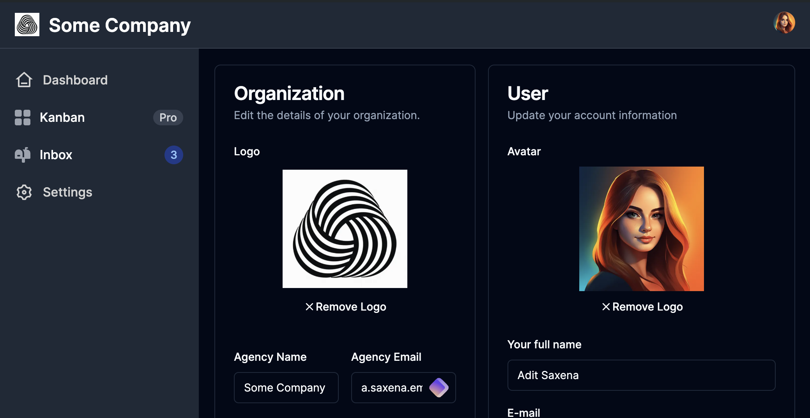
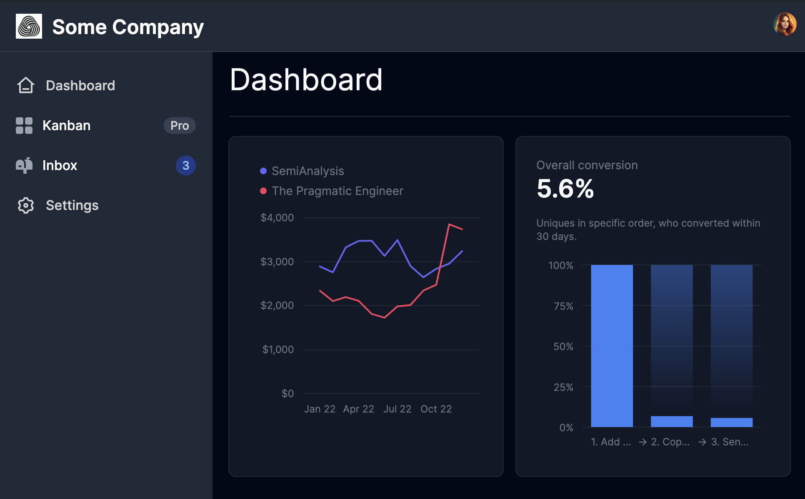

## About

Simple demo on:

| Service         | Purpose                       |
| --------------- | ----------------------------- |
| NextJS          | with router navigation        |
| Prisma          | Postgres Database ORM         |
| Shadcn UI       | Copy & Paste React components |
| Tremor UI       | React components              |
| React Hook Form | React form management         |
| ClerkJS         | Authentication service        |
| Uploadthing     | File upload service           |

<br />

Some screenshots:



<br />



## Install

- Copy & fill `.env` from `.env.example`

- Install the database

  ```bash
  # Run SQL: `CREATE DATABASE supa_tickets_dev`
  bun prisma db push
  ```

## Run

Run the development server:

```bash
bun dev
bunx prisma studio # (optional) View data
```
